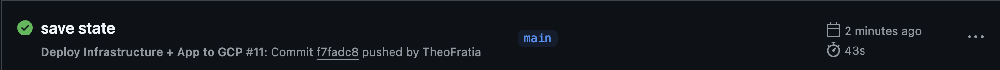

# Rapport de Projet – Déploiement Continu API IoT

## Domaine fonctionnel
Déploiement d’une API de supervision de capteurs environnementaux (IoT) via un pipeline CI/CD complet.

## Choix techniques
- **Provider Cloud** : Google Cloud
- **Déploiement** : Ansible
- **CI/CD** : GitHub Actions
- **Stack API** : Node.js

## Arborescence

```
Terraform-deploy/
├── credentials.json
├── rapport.md
├── Release.sh
├──ansible/
│   ├── deploy.yml
│   └── inventory.ini
├── api/
│   ├── index.js
│   └── package.json
└── infra/
    ├── main.tf
    ├── outputs.tf
    ├── terraform.tfstate
    ├── terraform.tfstate.backup
    └── variables.tf
```

---

## 1. Fonctionnement de la configuration Terraform & du playbook Ansible

### Terraform
- Décrit l’infrastructure dans `infra/main.tf`.
- Crée une VM avec une IP publique, un disque booté sur Ubuntu, et applique un script d’initialisation minimal.
- Les variables (`variables.tf`) permettent de changer facilement la région, le projet, la zone.
- L’output (`outputs.tf`) expose l’IP publique de la VM pour la suite du déploiement.

### Ansible
- Utilise un inventaire dynamique (`inventory.ini`) mis à jour avec l’IP de la VM.
- Le playbook (`deploy.yml`) :
  - Installe Node.js, npm, git
  - Clone le repo de l’API
  - Installe les dépendances npm
  - Installe PM2 pour la gestion du process
  - Démarre l’API avec PM2

---

## 2. Déroulé du pipeline CI/CD (GitHub Actions)

Le pipeline CI/CD est défini dans `.github/workflows/deploy.yml` :

1. **Déclencheur** : à chaque push sur `main`.
2. **Étapes principales** :
   - Checkout du code
   - Setup de Terraform et authentification GCP
   - Création du fichier `terraform.tfvars` avec les credentials nécessaires
   - `terraform init` puis `terraform apply` pour provisionner l’infra
   - Récupération de l’IP publique de la VM
   - (Étape manuelle ou automatisée) : mise à jour de l’inventaire Ansible avec la nouvelle IP
   - Exécution du playbook Ansible pour déployer l’API

## Screenshots



---